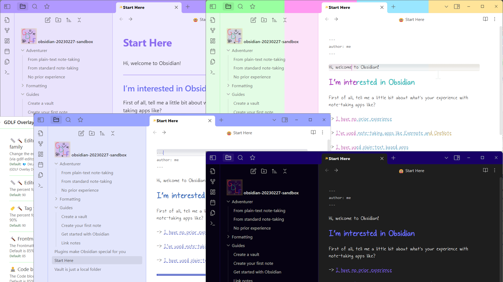

# The Overlay Theme

This is a minimal theme for Obsidian. It's also a Snippet you can use against other themes, though how well the snippet works is untested on any theme other than the Default.

The theme offers some basic settings, while the Snippets are a bit more detailed. 

The project is organized to be as modular as I could think to make it, isolating elements I wished to augment without impacting other Obsidian features.

## Installation

At present, the theme is not part of Community themes, so you may clone this repository, create an `Overlay` folder in your vault's `.obsidian/themes/` folder and then copy-and-paste the `theme.css` and `manifest.json` files into that folder.

The Snippets are generated by `deploySASSY.ps1`, which takes as it's first argument the location of your `.obsidian` folder. So if your vault were at `/home/itme/hello-world/`, you would want to pass `/home/itme/hello-world/.obsidian` as the first argument. The Snippets generated are `gdlf-overlay.css`, `gdlf-for-me.css`, and `gdlf-full-overlay.css`. They will be placed in your `.obsidian/snippets` folder. The settings they offer are configured with the Style Settings plugin, as described below:

## Note about Style Settings

Most of the features of the theme depend on [Style Settings](https://github.com/mgmeyers/obsidian-style-settings), which is an Obsidian Community plugin. If you have that plugin installed and enabled, you'll be able to toggle certain settings and use sliders to adjust the size of many of the types of text Obsidian displays. With Snippets enabled, you will have access to more settings. (I don't recommend enabling the Snippets and the theme at the same time, but it's probably harmless to do so.)

The theme defaults to using a font I built with [Calligraphr](https://www.calligraphr.com/) using [Inkscape](https://inkscape.org/) and an active stylus. (One may also print sheets of paper and manually ink their letters.) It also features a transparent logo of "GDLF", which represents "Gustavo DeLaFuerza", which will display next to your vault's title.

The best way to look at this theme is to place it in the `themes` folder for the Help vault. That is the vault shown in the cover image, above.

## Features

The theme offers these Accent color features:

- Bold and italics based on Accent color
- Background for active line in Editor
- Background colors based on Accent color
- Secondary Background based on Accent color
- Header tags based on Accent color
- Highlights (mark tag) based on Accent color

Customize font-sizes:

- Editor font-family (for Edit mode)
- Editor font-size adjustment by percent
- Tag font-size adjustment
- Frontmatter font-size adjustment
- Code block font-size adjustment
- Inline code font-size adjustment

Customize other things:

- Inline code text color (defaults to Obsidian's app.css default)
- "Solid" instead of floating Status bar
- "Standardized" header (tag) sizes
- No Image animations
- External links with 🔗 emoji
- Embed blocks become a bit larger
- Adds a ✨ emoji to the file header / title
- Adds a 🤓 emoji to the file header / title
- Adds a ⊞ to the fold ellipsis
- Adds some formatting for Footnotes
- Tags have a "pill" shape

Bonus things that would probably need customization but don't have it yet:

- Some Tags colored by name
- Rainbow cursor (mostly for Vim mode)
- Removal of embedded document's title
- Add a GDLF vault icon
- Add a GDLF font-family based on my handwriting
- Hide some folders based on their name
- Show emojis for some folders based on their name

Aside from the dozens of features I listed, this theme is intended as minimally changing what Obsidian offers with the Default theme. Also, this project is built with an eye forward to Obsidian's current `app.css` CSS classes and variables and what I want to be the minimum SCSS I need to get what I want. 

## Overlay snippets

Additional to the theme, there are overlay snippets. **These may or may not work.** With the default theme and Style Settings *ideally* the "full" overlay CSS snippet *should* display over the top of the Default theme as if the Overlay theme were active. 

## Style Settings

For the Overlay used as a snippet, all settings must be toggled with the Style Settings plugin.

Using the Overlay theme, most settings are default, but you may still adjust font sizes and whether the primary (document) and secondary (app) backgrounds are based on the Accent color. 

## Screenshots

In practice, the overlay looks like the banner for this README.

## Building the Project

To build this project, `sass` needs to be available at your command line. `deploySASSY.ps1` is an example of creating the Theme and related Snippets in PowerShell. The current `theme.css` also builds/renders to the root folder of this project. Read the source of the PowerShell script before running it. 

Here are the files generated with the example PowerShell script:
- gdlf-overlay.css - The Overlay snippet minus stuff I built just for me
- gdlf-full-combined.css - The complete Overlay snippet
- two theme.css files - The Overlay theme, one renders to the themes folder, and the other to the base folder of this project
- gldf-media-print.css - Some @media print settings I haven't tested in maybe over a year... 

Bonus CSS, which are separate Snippets:
- plugin-reminders.css - Custom CSS for the Reminders plugin
- plugin-grandfather.css - Custom CSS for the Grandfather plugin
- plugin-todo-list.css - Custom CSS for the Todo List plugin 
